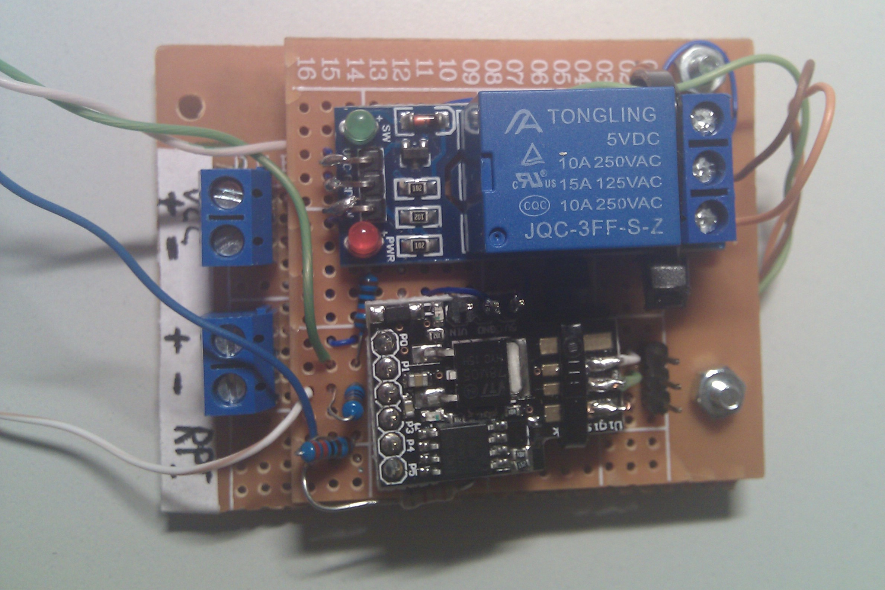

# Power Button
Simple switch for controlling electronic devices like the Raspberry Pi

### *Preamble*
This project was born due to some troubles related to Raspberry Pi device when used as a media
center with Kodi. I'm a big fan of the RPi and XBMC/Kodi/LibreElec mashup, but not that much when
you mix them with chinese low cost power supply units (PSUs) and so called "Smart TVs", the word
_"smart"_ is too much overhyped and commonly misused.  
With a basic Raspberry Pi setup, a local usb hard drive and those cheap 5V 5A (lucky when you achieve
**real** 5V ~2.5A and 60% efficiency) you need to connect them to the TV.  
As commonly reported from
other users strange things might happen when the Pi is in doze/sleep mode and sometimes it restarts
or power it up again. TV starts (from HDMI signal) and the Pi boots with libreelec.  
It seems HDMI cable connected to the TV might be the culprit due to undocumented, buggy,
messy implementation on the TV or sometimes there's something related to voltage differential
between the PSU and the tv set (even with a common negative).
I've spent months on that and I finally gave up, that's the reason why I've started this project.  
The basic idea is to give power voltage to the rasbperry only when needed (with a button) and cut it
off when the Pi is turned off again. Everything is done with a relay (brutal) and a low voltage MCU
to control it, ATTiny85 seems to be a low voltage solution to achieve a viable workaround 
on these problems.  
It might seems to be an overengineered solution but it's a viable and pratical way to solve this
kind of mess.

_pretty rough but simple and works well_

---

## Desired Solution
_A simple appliance for a simple solution_.  
Just a single and visible button. With a simple press it turns ON the Raspberry as well as the TV.
When the TV Set is turned on a single press turn the appliance OFF as well as the TV
with a clean and planned raspberry shutdown or a brutal one if the Pi is freezed (due to a kody crash
or libreelec problems, sometimes it happens...) after a defined watchdog time.

## Operation
- ATTiny is connected to the button, the relay and the power supply. It's always powered on
but mostly in doze mode in order to consume just few mAmps.
- When button is pressed and the Raspberry is off it turns it on
- When button is pressed and the Raspberry is on it turns on a GPIO pin to order to request a safe
shutdown, if the raspberry is totally frozen it abruptly cuts of the power after a planned watchdog
time.
- If the raspberry is cleanly powered off it detects lack of operations (from a GPIO-input) and cuts
power from the relay.

As simple as that, PDF and KiCad files with it.

## BOM
see [BOM.md](attiny85/BOM.md) for the full list.  
Complete schematics available as KiCad .sch file but ready made .pdf is available too

## Software
- source code available for the raspberry pi daemon (python) and the ATTiny85 device (C++
and PlatformIO)
- .hex with precompiled binary code always provided for the lazy

Feel free to comment, open issues, pull requests or whatever, share with others but please give
credits or support this project.
